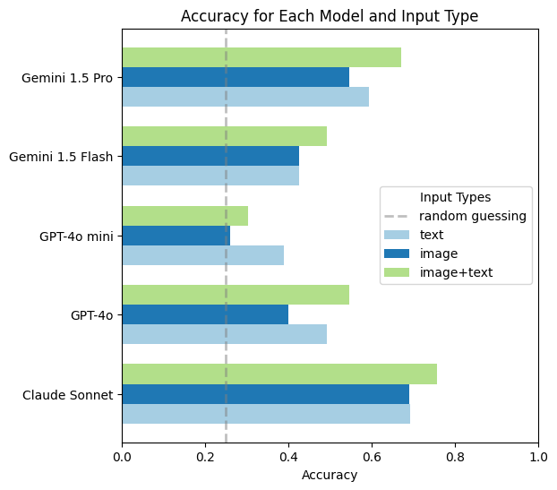

# GridQA: Evaluating Spatial Reasoning in Multimodal Large Language Models (MLLMs)

This repository contains the dataset, code, and experiment configurations for the **GridQA** project. GridQA is designed to evaluate the spatial reasoning capabilities of Multimodal Large Language Models (MLLMs) by testing their ability to recognize and classify basic transformations—**rotations, flips, and translations**—in grid structures. This task, while straightforward for humans, presents unique challenges for MLLMs and helps to reveal limitations in spatial reasoning within state-of-the-art models.

---

## Table of Contents

- [Introduction](#introduction)
- [Dataset](#dataset)
- [Code Structure](#code-structure)
- [Installation](#installation)
- [Usage](#usage)
- [Results](#results)
- [Citing GridQA](#citing-gridqa)
- [License](#license)

---

## Introduction

Multimodal large language models (MLLMs) have shown impressive performance on a variety of tasks by combining textual and visual data. However, they still struggle with simple spatial tasks involving basic transformations that are trivial for humans. GridQA provides a standardized dataset and framework to test these models' ability to correctly classify transformations in grid structures. Our experiments reveal model performance across various configurations and transformations, highlighting the need for enhanced spatial reasoning capabilities in MLLMs.

---

## Dataset

The **GridQA** dataset consists of grids containing shapes that have undergone specific transformations. These transformations include:

- **Rotation**: 90, 180, or 270 degrees
- **Horizontal Flip**
- **Translation**: Shift up, down, left, or right
- **Static**: No transformation

Each grid instance includes:

- Grids with shapes (randomly generated) in their original and transformed states
- Labels indicating the correct transformation applied
- A variety of configurations for shape size, grid dimensions, and shape count

The dataset can be downloaded from [GridQA Dataset on GitHub](https://github.com/christianjensen2903/GridQA/dataset.json).

---

## Code Structure

- `predict.py`: File to predict transformations for all models and all input types
- `prompts.py`: Prompts used for predictions
- `llm.py`: Code for various llms
- `formatter.py`: Formatter to convert grids to text
- `generate_dataset.py`: Code to generate dataset
- `generate_shape.py`: Code to generate random shapes
- `analysis.ipynb`: Code to generate various plots used in paper
- `dataset.json`: Generated dataset
- `predictions`: Predictions for various models and input types
- `README.md`: Documentation file.
- `requirements.txt`: Dependencies for the project.

---

## Installation

1. Clone the repository:

```bash
git clone https://github.com/christianjensen2903/GridQA.git
cd GridQA
```

2. Create virtual environment:

```bash
python -m venv venv
source venv/bin/activate
```

3. Install the required dependencies:

```bash
pip install -r requirements
```

Here’s a suggested `README.md` file for your GitHub repository:

---

## Usage

### 1. Generating dataset

To generate new dataset

```bash
python generate_dataset.py
```

### 2. Run predictions

To evaluate a model on the GridQA dataset:

```bash
python predict.py
```

### 3. Analyse data

Run `analysis.ipynb`

---

## Results

### Model Performance Summary

Models evaluated include:

- **GPT-4o**
- **GPT-4o mini**
- **Gemini 1.5 Pro**
- **Gemini 1.5 Flash**
- **Claude 3.5 Sonnet**

Each model was tested using three types of input: **text, image, and image+text**. Below is a sample performance chart:



For more in-depth results, see the [full results](https://github.com/christianjensen2903/GridQA/analysis.ipynb).

---

## Citing GridQA

If you use this dataset or code in your research, please cite our paper:

```bibtex
@article{jensen2024gridqa,
  title={Assessing Spatial Reasoning Deficits in Multimodal Large Language Models},
  author={Christian Mølholt Jensen, Peter Bjerre Hansen, Lukas Rønman Behr, Mads Emil Christensen},
  journal={University of Copenhagen},
  year={2024}
}
```

---

## License

This project is licensed under the MIT License - see the [LICENSE](LICENSE) file for details.
